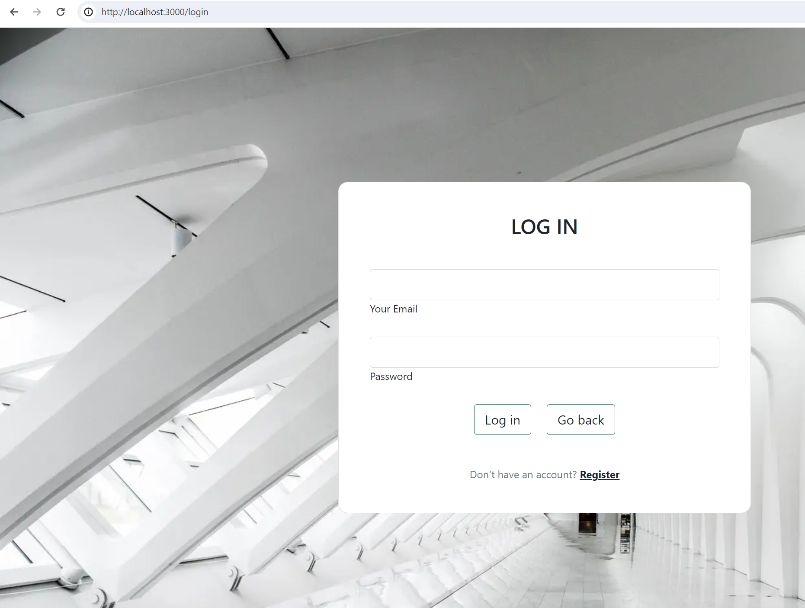
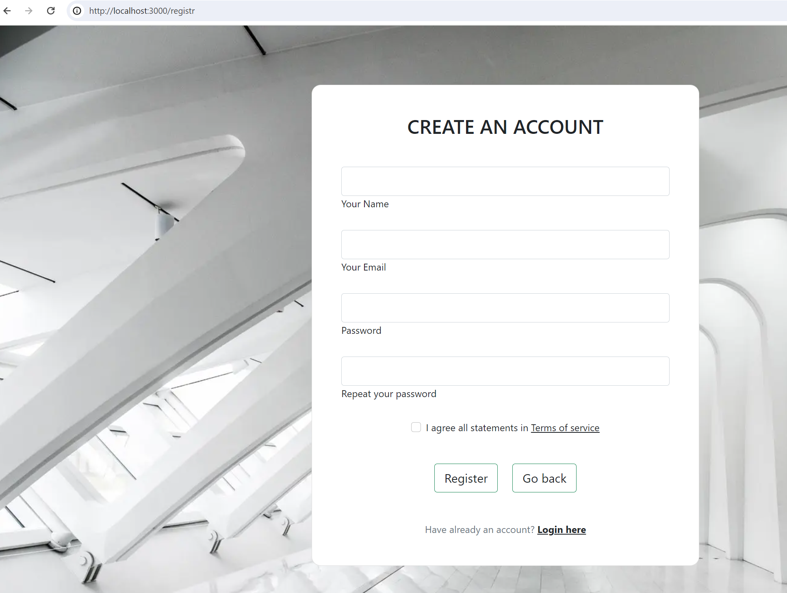
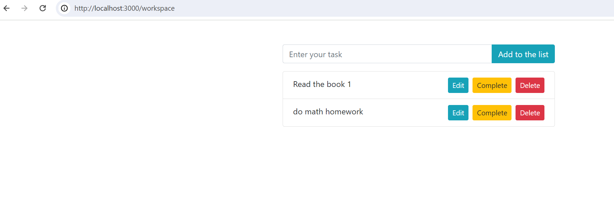

# Taskify: Project Report

**Team Members:** Abidzhanov Iliyas, Ali Samal, Tuleubayeva Marzhan

**Group:** SE-2219

## Project Overview

Taskify is a task management web application designed to streamline task organization, prioritization, and tracking for individuals and teams. With its intuitive interface and real-time updates, Taskify aims to enhance productivity and goal achievement.

## Technical Specifications

### Server Configuration (`server.js`)

- **Express Setup**: Utilizes Express.js for server creation and routing.
- **Middleware Usage**: Implements middleware for JSON parsing, cookie handling (using `cookie-parser`), and authentication token verification (using JWT).
- **Static File Serving**: Serves static files (HTML, CSS, JavaScript) from designated directories.
- **Route Handling**: Defines routes for user authentication, task management, and API endpoints.
- **Database Connection**: Connects to MongoDB Atlas using Mongoose for data storage.

### Route Handling (`routes/index.js`, `routes/tasks.js`)

- **User Routes**: Manages user registration, login, activation, and authentication processes.
- **Task Routes**: Handles CRUD operations for tasks, including creation, retrieval, updating, and deletion.

### Model Definitions (`models/user.js`, `models/task.js`, `models/token-model.js`)

- **User Model**: Defines user schema including name, email, password hash, activation status, and activation link.
- **Task Model**: Specifies task schema with text and completion status fields.
- **Token Model**: Represents schema for storing user tokens, particularly refresh tokens.

### Service Modules (`service/mail-service.js`, `service/token-service.js`)

- **Mail Service**: Sends activation emails to users upon registration, utilizing Nodemailer for SMTP functionality.
- **Token Service**: Generates access tokens and refresh tokens for user authentication and manages token storage in the database.

### Frontend Scripts (`scripts/task.js`)

- **Task Management**: Implements frontend logic for task interaction, including creation, deletion, completion, and editing.
- **API Interaction**: Communicates with server-side API endpoints to perform CRUD operations on tasks.

### Additional Components

- **Nodemon**: Utilized for automatic server restarts during development, ensuring rapid iteration and debugging (`npm run dev`).
- **JWT Tokens**: Employed for user authentication and authorization, providing secure access to protected routes and resources.

## Installation Process

1. **Clone Repository**: Clone the Taskify repository from GitHub using the command:

git clone https://github.com/your-username/taskify.git

2. **Navigate to Directory**: Enter the project directory:

cd taskify

3. **Install Dependencies**: Install project dependencies using npm:

npm install

## Connection to Application

1. **Environment Configuration**: Set up environment variables for SMTP configuration, JWT secrets, and API URLs in a `.env` file based on provided sample `.env.sample`.

2. **Start Server (Development)**: Run the server in development mode using Nodemon for automatic restarts:

npm run dev

3. **Access Application**: Open a web browser and navigate to `http://localhost:3000` to access the Taskify application.

## Database Collections

1. **Users Collection**:
- Schema: `{ name: String, email: String, password: String, isActivated: Boolean, activationLink: String }`
- Stores user data including name, email, password hash, activation status, and activation link.

2. **Tasks Collection**:
- Schema: `{ text: String, completed: Boolean }`
- Stores task data including task description and completion status.

3. **Tokens Collection**:
- Schema: `{ user: ObjectId, refreshToken: String }`
- Stores refresh tokens associated with user IDs for authentication purposes.

## Correctness of Application with Database

1. **User Registration**: Test user registration functionality by signing up with valid credentials. Verify that user data is correctly stored in the Users collection.

2. **Task Creation**: Create new tasks through the application interface. Ensure that task data is successfully added to the Tasks collection.

3. **Task Management**: Perform CRUD operations on tasks (create, retrieve, update, delete) and verify their correctness with database interactions.

4. **User Authentication**: Test user login and logout functionality. Verify that user authentication tokens are correctly generated and managed in the Tokens collection.

### Screenshots

**Future features and technical solutions (just temporary list) :**

- The ability to share with other users via mail (like in notion), to have a common workspace 
-  To the previous point: whoever creates this workspace should be able to regulate access (just like in the notion or google docs, allow only reading or editing too). It will be useful for team leaders, etc.
- Calendar
- LogOut
- Pomodoro
- RestFul API
- Security
- Error Handling development
- Import files (JS Multer Library)
- Forgot password functionality
- Rate limiting
- Recycle bin (periodic cleaning of the recycle bin and the ability to restore records before the expiration date)
- Frontend development
- Dashboard or something like trello workspace
- Unit tests
- Deployment
